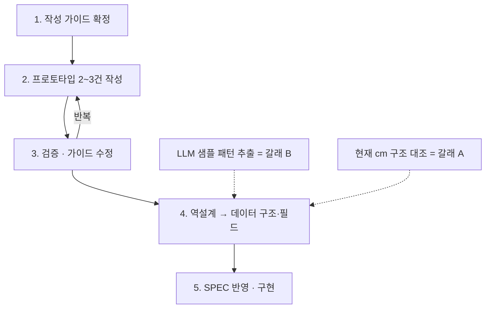

## 에고그램 리포트 리디자인 — 작업 계획

#### 이 노트는

아리공+에이전트용 **실행 계획**이다. 지향(왜 이렇게 설계하나)은 [[리포트 설계 원칙]]에, 피터공용 과정 기록은 [[요청.26.0528.1530-에고그램리포트비교]]에 있다. 이 노트는 그 지향을 어떤 단계로 실행하는가만 다룬다. 단계 체크리스트로 진행하고, 진행 상태를 live로 갱신한다.

핵심 합의(26.0528): 두 갈래 — (A) 우리 데이터 구조·소제목·포맷 조정 / (B) LLM 샘플에서 소제목·짧은 강점·한 줄 키워드·표현을 데이터화 — 는 따로 굴리지 않는다. **B가 A의 입력**이고, 둘은 4단계(역설계)에서 합류한다. 데이터 구조부터 그리지 않고, **가이드 정하고 실제로 써본 뒤 그 결과물을 분해해서 구조를 도출**한다.

#### 전체 흐름

#### 1단계 — 작성 가이드 확정 (현재 진입점)

북극성+원칙 5개를 "이렇게 써라"는 실행 규칙으로 구체화한다.

- [ ] 섹션별 구조 정의 — 성향분석 / 강점 / 조율 포인트 / 거절 대응 각각의 진입 레이어 + 소제목 + 본문 형식
- [ ] 유형 라벨 평이 번역 규칙 (라벨 옆 한 줄, 척도 명시) — 원칙 1
- [ ] 조회 키를 숨기고 문장으로 푸는 규칙 — 원칙 2
- [ ] 가벼운 진입 레이어 형식 (깊은 본문 앞 요약 한 겹) — 원칙 3
- [ ] 관점 소제목 패턴 (역할별 영업/업무/관리 등) — 원칙 4
- [ ] cm1 키워드 강점우선 손질 — 낮은 점수대 부정어(FC 0-7 "무표정·경직됨" 등)를 중립/강점으로. 성향분석 첫 화면 평이 번역 재료
- 진행: ✅ 성향분석(첫 화면) 섹션 가이드 확정(26.0528) → [[리포트 설계 원칙]] 작성 가이드 섹션. 다음 = 강점(§2)
- 산출물: 작성 가이드 ([[리포트 설계 원칙]]에 "작성 가이드" 섹션으로 누적)
- 담당: 아리공 + 피터공 합의

#### 2단계 — 프로토타입 작성 (2~3건)

가이드로 실제 리포트를 써본다. 같은 사람을 옛 포맷과 나란히 두어 비교 가능하게.

**방향 전환 (26.0528, 피터공 제안)**: md 프로토타입을 따로 쓰지 않고 **실제 admin 안에서 비교**한다. 기존 "리포트 보기" 버튼은 그대로 두고 그 옆에 작은 `[v2]` 버튼을 더해, 같은 사람·같은 점수를 v1(운영)과 v2(리디자인)로 즉시 나란히 본다. v2는 기존 `ReportPage`를 복제한 `ReportPageV2`로, 가이드가 확정된 섹션부터 하나씩 갈아끼우며 자라는 **코드 내 프로토타입 무대**다. 운영 리포트 무손상(새 라우트 `#/report-v2/:id` + 새 컴포넌트, 기존 코드 무수정). md 산출물보다 무겁지만 실제 점수·실제 렌더로 비교가 강하고 손소장에게 보여주기도 낫다. 4단계 역설계 때 v2 안 인라인 콘텐츠(강점우선 cm1 손질 등)를 데이터로 추출.

- [x] v2 인프라 — 라우트 `#/report-v2/:id` + `ReportPageV2.jsx`(v1 복제) + admin `[v2]` 버튼 (26.0528)
- [x] 피터공 3제안 반영 (26.0528, [[리포트 설계 원칙]] 원칙 6·7 + 자동생성 아키텍처):
  - (1) intro 번호 리스트 → 서술형 2문단
  - (2) §1 = 종합 성향 정체성("OO님은 ___한 분") 먼저 + 소제목 분절 + 그래프 라벨 코드명("통제적부모") → 강점 평이어("기준·결정력"), ego 코드는 흐린 보조
  - (3) §2 강점 = 정체성에서 잇는 리드 + cm3 조회 키 괄호("(CP & NP ...)") 제거(원칙 2)
  - 정체성 명명 = top1_top2 조합 테이블(추천안 A). 1차 9조합 인라인 + 미충원 fallback(두 강점 합성). 4단계서 20조합 yaml화
- [x] §3·§4 텍스트 절감 + 조회 키 제거 (26.0528, 피터공 "3,4번 텍스트 많아 잘 나눠야 / §3 CP·NP 타이틀 안 읽힘"):
  - §3 조율: 중복 점수표 제거 + h4 평이 라벨(EGO_PLAIN_LABEL) + **조율 필요한 성향만 카드, 나머지는 "균형이 좋아 조율할 것 없는 성향: …" 한 줄** + cm4 괄호 메타("(원칙이 강하고…성향)") stripMeta 제거
  - §4 화법: 조회 키("TOP1 CP + TOP2 AC + BOTTOM FC") 제거 + "이렇게 말합니다 / 한 가지 더하면" 소제목 분절
  - §5 거절대응: 같은 조회 키 제거(원칙 2 일관성)
  - stripMeta 정규식 확장 — "성향)" 포함
- [x] 유형 강점 명칭 "~의 힘" + 가장 강한 힘(top1) 부각 (26.0528, 피터공 선택 — 손소장 강조점): CP 기준을 세우는 힘 / NP 마음을 살피는 힘 / A 흐름을 읽는 힘 / FC 분위기를 여는 힘 / AC 보폭을 맞추는 힘. §1 정체성 카드 최상단에 "가장 강한 힘 — {top1}" 큰 글씨 + 종합 인물상 잇기. EGO_TYPE_NAME 인라인
- [x] **손소장 26.0529 아침 피드백 반영** ([[요청.26.0529.1254-에고그램손소장피드백]]): ① 목적 짧게(이미지1 3문단) ② 핵심 두 단어 교체(CP 기준·결단/NP 배려·공감/A 이성·판단/FC 친화·표현/AC 협조·조율 — `EGO_PLAIN_LABEL`) ③ §4 제목 화법→말투(리더·코치 통일, `ui_texts.yaml`) ④ §4 소제목 2개 삭제(이렇게 말합니다·한 가지 더하면). 빌드 통과
- [x] **§1 읽기 흐름 — 강약 차등(원칙 8, 방향 A)**: "성향별로 자세히 보기"를 다섯 평등 리스트 → 점수 순 정렬 + top1·top2만 깊은 본문 + 나머지 셋 한 줄 묶음. 피터공 "유형 단위라 끊긴다" 해결. `.report-traits-rest` CSS 신설
- [x] 피터공 §1~§4 v2 육안 검토 — 가장 강한 힘 부각 / 유형 명칭 5종 / 정체성 명명 톤 / fallback / §3 "조율 불필요 한 줄" / **손소장 4건 + §1 강약 차등(26.0529)**. → 검토 통과, v2를 최종 리포트로 채택(26.0604)
- 미정: 지금 인라인 → yaml 데이터화 시점 (문장 확정 후 4단계). 피터공 "데이터로 추가한거지?" 확인 — 아직 인라인 프로토타입임을 공유
- [ ] 정지희(컨설턴트, CP10 NP18 A10 FC16 AC16) [v2]로 확인 → 옛 LLM판과 비교
- [ ] 조성순(컨설턴트, CP16 NP10 A10 FC7 AC11) [v2]로 확인 → 옛 우리 템플릿판과 비교
- [ ] (선택) 코치 또는 관리자 1건 — 역할별 포맷이 견디는지
- 산출물: v2 리포트 (admin [v2] 버튼으로 접근)
- 담당: 아리공 직도 (소수라 통제 가능)

#### 3단계 — 검증 · 가이드 수정

- [ ] 피터공 육안 검토 — "맞아맞아" 나오나
- [ ] 북극성 체크: credibility(정확히 봤다) → 공감(이게 나다) → 동의(조언 받아들이겠다)
- [ ] 걸리는 지점 가이드에 반영, 필요시 2단계 재작성
- 담당: 피터공 검토 + 아리공 수정

#### 4단계 — 역설계 → 데이터 구조·필드 (갈래 A·B 합류)

검증된 프로토타입을 분해해 데이터 구조를 도출한다.

- [ ] 프로토타입 각 요소 분류: 데이터 변수(점수에서) / 고정 스캐폴딩(소제목 등) / 조합 텍스트 / LLM 생성 슬롯
- **갈래 B — LLM 리포트 데이터화 가능성 검토·도출** (피터공 26.0528 확인. 프로토타입 검증과 병렬 착수 가능 — 원본만 있으면 됨):
  - 원본: `Assets/incoming/에고그램/AI생성 리포트/` — 컨설턴트·관리자·코치/멘토 성향분석 docx 3종(각 45~70명)
  - [ ] (1차/파일럿) 컨설턴트 docx 백도 분석 — 손소장이 같은 점수 조합을 어떻게 종합·명명·서술했는지 패턴 도출. 무엇이 데이터화 가능한지 먼저 판단(가능성 검토)
  - 추출 타깃: ① top1+top2 조합별 **정체성 명명·요약**(지금 인라인 손작업을 대체할 진짜 데이터) ② 강점 **관점 소제목** 패턴(영업/관계/업무) ③ 유형별 **강점 키워드·표현 톤** ④ 조율·화법 문장 패턴
  - 방법: 백도 1개 파일럿(컨설턴트) → 검증 후 관리자·코치 병렬. 개인 변주(이름·구체 일화) 걷어내고 조합 단위로 일반화
- [ ] 갈래 A — 현재 cm yaml 구조와 대조, 추가/변경 필드 정의
- [ ] 새 데이터 스키마 초안 (B 도출 패턴 + A 기존 구조 합류)
- 담당: 백도(LLM 추출) + 아리공(구조 설계)

#### 5단계 — SPEC 반영 · 구현

- [ ] SPEC.md 갱신 (선문후코 — 구조 확정 후 코드)
- [ ] ReportPage.jsx / cmLookup / 데이터 마이그레이션
- [ ] 빌드·배포·검증, 커밋+푸시 (Air에서)
- 담당: 아리공

#### 현재 위치

**v2 = 최종 리포트 확정 (26.0604).** 1~3단계(가이드·프로토타입·검토)를 거쳐 피터공이 v2 인라인 프로토타입을 그대로 운영 리포트로 채택했다. v3(LLM 톤 비교) 트랙은 폐기 종결 — 기존 `cm_insurance`가 이미 손소장 LLM 리포트의 데이터화본이라 비교가 무의미했다([[26.0601 에고그램 LLM 리포트 재점검 — 기존 데이터가 곧 그 LLM 리포트였다]]).

- 정식 경로 `/report/:id` → `ReportPageV2` 렌더. admin v2·v3 곁버튼 제거, 리포트 좌상단 "v2" 깃발 제거, 죽은 v1/v3 라우트 정리. SPEC 반영(`REPORT-V3-LLM.md` 결정 블록 + `SPEC.md §5 라우팅`).
- 4단계(인라인 → yaml 데이터화)는 **손소장 논의 후로 보류**. §1 문장형 흡수 재료는 `cm_llm_sales.yaml`에 보존.
- 미해결(다음 단계): 일괄 PDF(`ReportBatchPage`)가 아직 v1 `ReportView`를 쓴다 → v2 기반으로 통일 필요.
